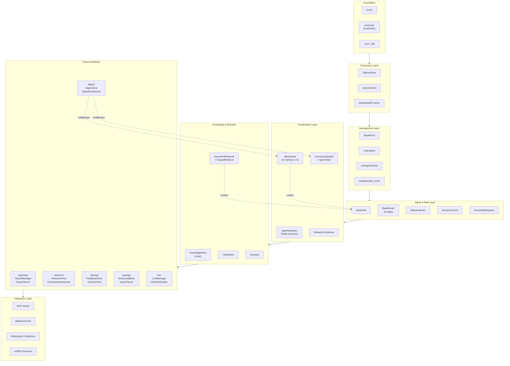
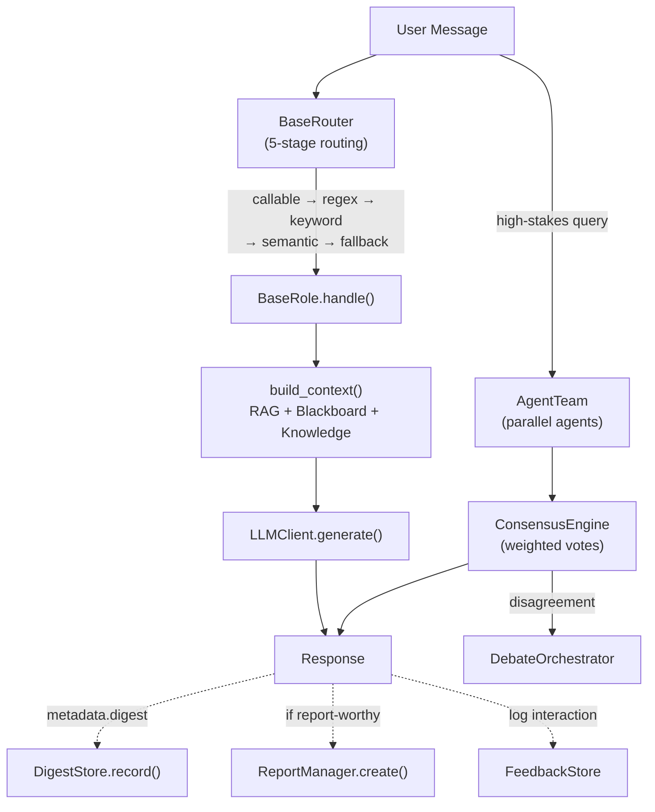
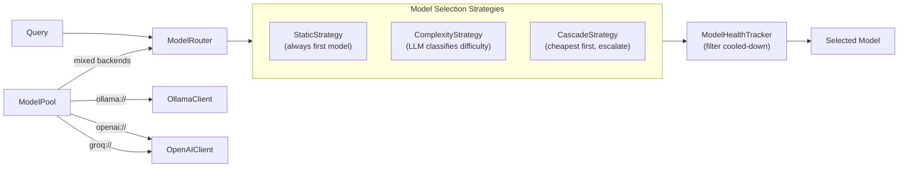
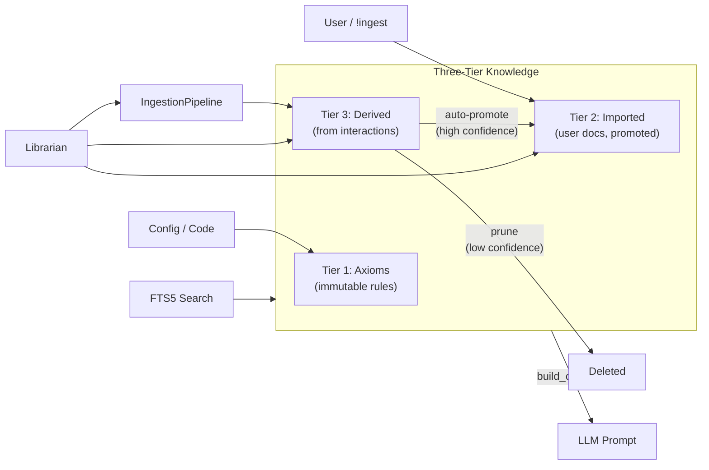
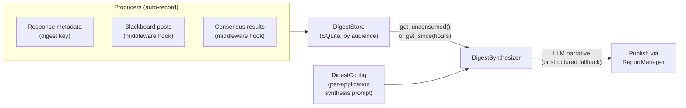

# Architecture

khonliang is organized as a layered framework where each layer builds on the one below. All modules are optional — applications import only what they need.

## Layer Diagram

## Request Flow

## Model Routing

## Knowledge Flow

## Digest Pipeline

## Module Overview

### Foundation

The bottom layer provides error types, the `LLMClient` protocol, and shared utilities. These have no internal dependencies.

| Module        | Purpose                                                                                                                                       |
| ------------- | --------------------------------------------------------------------------------------------------------------------------------------------- |
| `errors`      | Typed error hierarchy: `LLMError`, `LLMTimeoutError`, `LLMUnavailableError`, `LLMModelNotFoundError`, `LLMRateLimitError`, `LLMCooldownError` |
| `protocols`   | `LLMClient` — runtime-checkable protocol satisfied by both clients                                                                            |
| `_json_utils` | JSON cleanup for LLM outputs (Python-style booleans, trailing commas)                                                                         |

### Connection Layer

Async HTTP clients for LLM inference with retry, streaming, and typed errors.

| Module          | Purpose                                                                                                                                       |
| --------------- | --------------------------------------------------------------------------------------------------------------------------------------------- |
| `client`        | `OllamaClient` — async client for Ollama `/api/generate` with exponential backoff (3 attempts), JSON generation, and token-by-token streaming |
| `openai_client` | `OpenAIClient` — async client for any `/v1/chat/completions` endpoint (vLLM, SGLang, Groq, Together AI, Fireworks, OpenRouter, etc.)          |
| `health`        | `ModelHealthTracker` — tracks failures per model, enforces cooldown (default: 3 failures in 300s triggers 60s cooldown)                       |

Both clients implement the `LLMClient` protocol, so application code can swap backends without changes.

### Management Layer

Maps roles to models and routes messages to the right handler.

| Module                 | Purpose                                                                                                                                                              |
| ---------------------- | -------------------------------------------------------------------------------------------------------------------------------------------------------------------- |
| `pool`                 | `ModelPool` — role-to-model mapping with lazy client creation. Supports mixed backends via URI scheme: `"openai://model"`, `"groq://model"`                          |
| `routing/flow`         | `FlowClassifier` — LLM-based intent classification (SAVE/EXECUTE/UPDATE/EXPLAIN/OTHER)                                                                               |
| `routing/semantic`     | `SemanticIntentRouter` — FastEmbed cosine similarity for message-to-route mapping (<5ms per call)                                                                    |
| `routing/model_router` | `ModelRouter` — selects which model handles a request within a role. Three strategies: `StaticStrategy`, `ComplexityStrategy`, `CascadeStrategy` (FrugalGPT pattern) |

### Agent & Role Layer

The abstraction layer for domain-specific agents.

| Module            | Purpose                                                                                                                                   |
| ----------------- | ----------------------------------------------------------------------------------------------------------------------------------------- |
| `roles/base`      | `BaseRole` — abstract base class. Subclasses implement `handle()` and optionally `build_context()` for RAG/DB injection before generation |
| `roles/router`    | `BaseRouter` — 5-stage message routing: callable predicates, regex patterns, keyword lists, semantic embeddings, fallback                 |
| `roles/evaluator` | `BaseEvaluator` — pluggable rule system for response quality evaluation                                                                   |
| `roles/session`   | `SessionContext` — per-conversation exchange tracking for multi-turn coherence                                                            |
| `personalities`   | `PersonalityConfig`, `PersonalityRegistry` — named agent personas with voting weights, focus areas, and `@mention` resolution             |

### Coordination Layer

Multi-agent communication, shared state, and decision-making.

| Module               | Purpose                                                                                                                              |
| -------------------- | ------------------------------------------------------------------------------------------------------------------------------------ |
| `gateway/`           | `AgentGateway` — Redis Streams message bus for distributed agents. Fail-open: degrades gracefully if Redis is unavailable            |
| `gateway/blackboard` | `Blackboard` — in-memory key-value store with TTL for agent coordination. Sections, keys, and `build_context()` for prompt injection |
| `consensus/`         | `AgentTeam` runs N agents in parallel, `ConsensusEngine` aggregates via weighted scoring. `VETO` overrides all votes                 |
| `debate/`            | `DebateOrchestrator` — structured multi-agent debates with challenge/response rounds when agents disagree                            |

### Knowledge & Retrieval

Persistent knowledge management and document retrieval.

| Module                | Purpose                                                                                                                                                     |
| --------------------- | ----------------------------------------------------------------------------------------------------------------------------------------------------------- |
| `knowledge/store`     | `KnowledgeStore` — three-tier SQLite store: axioms (immutable rules), imported (user docs), derived (from interactions). Confidence scoring and FTS5 search |
| `knowledge/triples`   | `TripleStore` — semantic subject-predicate-object triples with confidence and time decay                                                                    |
| `knowledge/librarian` | `Librarian` — agent that curates knowledge: ingests content, promotes high-confidence entries, prunes stale ones                                            |
| `rag/retriever`       | `DocumentRetriever` — SQLite FTS5 with BM25 ranking                                                                                                         |
| `rag/scoped`          | `ScopedRetriever` — per-agent knowledge scopes: GLOBAL, DOMAIN, CONVERSATIONAL, EXPERT                                                                      |

### Feature Modules

Higher-level features built on the layers above.

| Module       | Purpose                                                                                                                                                                  |
| ------------ | ------------------------------------------------------------------------------------------------------------------------------------------------------------------------ |
| `reporting/` | Report persistence (SQLite), detection (pluggable heuristics), HTTP serving (Flask), and theming. HTML sanitized via `nh3`                                               |
| `digest/`    | Activity accumulation (SQLite transaction log with audience tagging), LLM-backed narrative synthesis, middleware hooks for Blackboard/consensus/response metadata        |
| `research/`  | `ResearchPool` with managed workers, `CompositeResearcher` for parallel multi-source search, `HttpEngine` for external APIs, `ResearchTrigger` for implicit research     |
| `training/`  | `FeedbackStore` for RLHF-style interaction logging, `TrainingExporter` for fine-tuning datasets (alpaca/sharegpt/completion), `HeuristicPool` for outcome-based patterns |
| `parsing/`   | `StructuredBlockParser` extracts typed JSON from LLM markdown. `QueryParser` uses LLM-backed structured extraction for natural language queries                          |
| `llm/`       | `LLMManager` with pluggable backends, `ModelScheduler` (score-based VRAM-aware scheduling), `ModelProfile` for per-model preferences, `ModelBenchmark` for validation    |

### Integration Layer

Bridges to external systems.

| Module                        | Purpose                                                                                                                                                                                                 |
| ----------------------------- | ------------------------------------------------------------------------------------------------------------------------------------------------------------------------------------------------------- |
| `mcp/`                        | `KhonliangMCPServer` — exposes up to 11 tools and 3 resources to external LLMs via Model Context Protocol. Actual count depends on which components are provided. Transports: stdio and streamable HTTP |
| `integrations/mattermost`     | `MattermostBot` — WebSocket connection with `on_mention` / `on_direct_message` handlers                                                                                                                 |
| `integrations/websocket_chat` | `ChatServer` — WebSocket chat with session tracking, role routing, and knowledge indexing                                                                                                               |
| `discovery/`                  | `ServiceAdvertiser` — mDNS service advertising and discovery via zeroconf                                                                                                                               |

## Storage

All persistent stores use SQLite. `ReportManager` and `DigestStore` enable WAL mode explicitly; other stores use SQLite defaults:

| Store               | Database     | Purpose                                |
| ------------------- | ------------ | -------------------------------------- |
| `KnowledgeStore`    | configurable | Three-tier knowledge with FTS5 search  |
| `TripleStore`       | configurable | Semantic triples with confidence       |
| `DocumentRetriever` | configurable | FTS5 document retrieval                |
| `ReportManager`     | `reports.db` | Report persistence with TTL (WAL mode) |
| `DigestStore`       | `digest.db`  | Activity transaction log (WAL mode)    |
| `FeedbackStore`     | configurable | Interaction logging for training       |

## Optional Dependencies

The core library requires only `aiohttp` and `requests`. Everything else is optional:

| Extra          | Packages                   | Enables                                   |
| -------------- | -------------------------- | ----------------------------------------- |
| `[rag]`        | fastembed, semantic-router | Semantic intent routing, embeddings       |
| `[mattermost]` | websocket-client           | Mattermost bot integration                |
| `[gateway]`    | redis                      | Redis Streams agent gateway               |
| `[discovery]`  | zeroconf                   | mDNS service discovery                    |
| `[mcp]`        | mcp                        | Model Context Protocol server             |
| `[reporting]`  | flask, markdown, nh3       | Report HTTP serving and HTML sanitization |
| `[all]`        | all of the above           | Everything                                |

## Key Design Patterns

- **Protocol-based abstraction** — `LLMClient` and `RoutingStrategy` are runtime-checkable protocols, not base classes
- **Lazy initialization** — `ModelPool` creates clients on first use; `SemanticIntentRouter` loads embeddings on first call
- **Fail-open coordination** — `AgentGateway` degrades gracefully when Redis is unavailable; `ScopedRetriever` falls back to BM25 when cross-encoder is missing
- **Middleware hooks** — Digest module patches into Blackboard and consensus without modifying those modules
- **Pluggable detection** — `ReportDetector` and `DigestConfig` let applications customize behavior without subclassing
